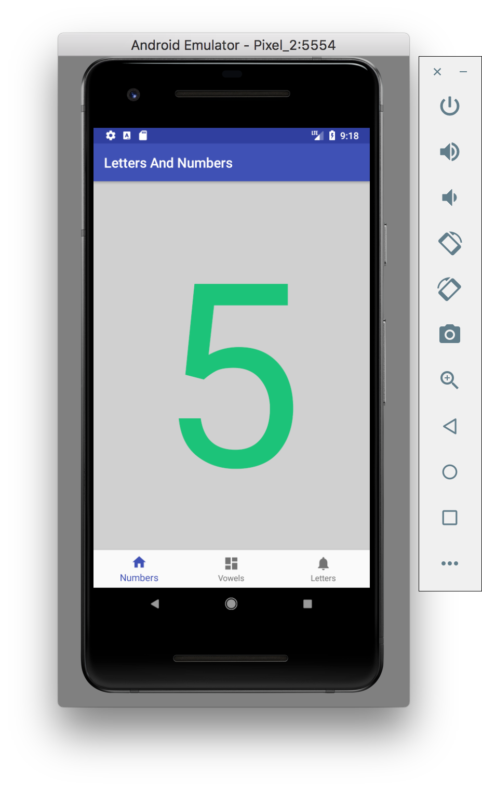

<!-- 

 -->
<h1 align="center">Letters And Numbers</h1>

Small app to teach kids how to count and learn the letters

  

  

Example of Android project showing integration with Kotlin and Dagger 2

## Created by
[Cesar Ferreira](https://cesarferreira.com)

## License
MIT © [Cesar Ferreira](http://cesarferreira.com)
